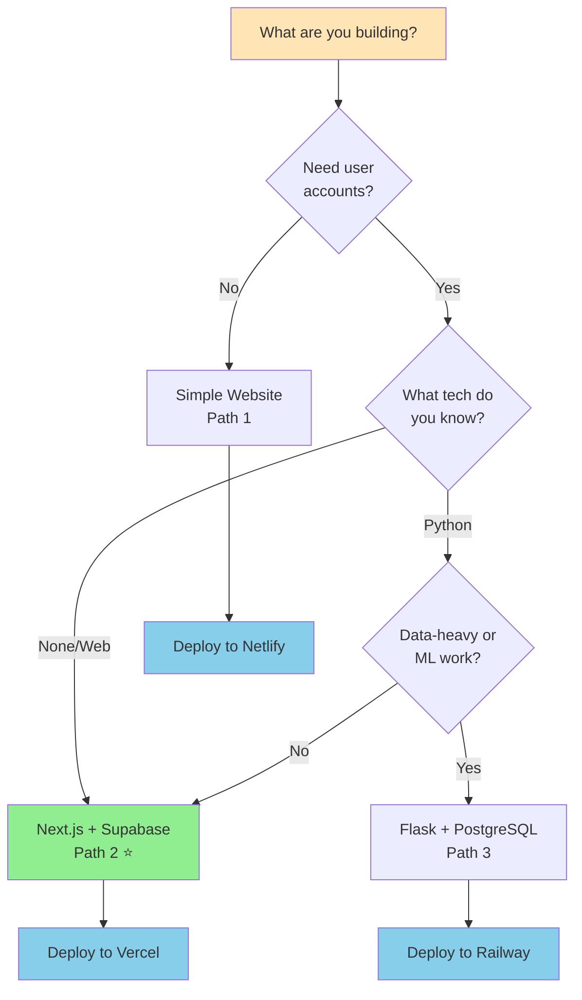

# Chapter 3: Choosing Your Stack

> "The best tools are the ones you'll actually use. The best stack is the one you can ship with."

## The Decision Paradox

There are hundreds of programming languages, frameworks, databases, and hosting platforms. Developers spend weeks researching "the best stack." This is decision paralysis disguised as due diligence.

Here's what actually matters: picking something that works and starting to build.

This chapter gives you three clear paths. Pick the one that matches your project type, follow it, and start building. You can always change later (and that's fine).

## The Three Paths

### Path 1: Simple Website or Landing Page
**Choose this if:** No user accounts, no database, just content
**Examples:** Portfolio, marketing site, documentation, blog

### Path 2: Web App with User Accounts
**Choose this if:** Users sign up, save data, interact with features
**Examples:** SaaS tools, community platforms, booking systems

### Path 3: Data-Heavy Python App
**Choose this if:** Processing data, analysis, ML, scientific computing
**Examples:** Data dashboards, analysis tools, automation scripts

**90% of people reading this guide need Path 2.** If you're not sure, that's your path.


## Quick Decision Flowchart



💡 **Most people should choose Path 2** (Next.js + Supabase) - it's the most versatile and AI-friendly.

---


## Path 1: Simple Website / Landing Page

### The Stack
- **Front-end:** React + Tailwind CSS
- **Hosting:** Netlify or Vercel (free)
- **Domain:** Namecheap ($12/year)

### What This Gets You
- Lightning-fast static website
- Perfect for SEO
- Free hosting with generous limits
- Easy to update and maintain
- No backend complexity

### When to Choose This
- Building a portfolio or personal site
- Creating a landing page for your product
- Publishing documentation or guides
- Setting up a blog (with tools like MDX)
- Anything where content is the same for everyone

### What You Can't Do (Yet)
- User accounts or login
- Saving user-generated content
- Processing payments
- Personalized experiences
- Any kind of database

### Tools You'll Use
**AI Assistant:** Claude or ChatGPT
**Code Editor:** Cursor
**Version Control:** GitHub
**Hosting:** Netlify (recommended for beginners)

### Time to First Deploy
**With AI:** 2-4 hours to have something live

### Cost Breakdown
**Infrastructure:**
- Hosting: $0 (Netlify or Vercel free tier)
- Domain: $13-15/year (optional - can use free subdomain initially)

**AI Tools (essential for vibe coding):**
- Claude Pro or ChatGPT Plus: $240/year ($20/month)
- Cursor Pro (optional): $240/year ($20/month) - free tier available

**Realistic Total:**
- Learning (free tiers): ~$0-15/year (just domain)
- Building (one AI tool): ~$253-268/year
- Optimal (both AI tools): ~$493-508/year

### Example Prompts
"Create a personal portfolio site with an about section, project showcase, and contact form"
"Build a landing page for my newsletter with email signup and feature highlights"
"Make a documentation site with a sidebar navigation and search"

---

## Path 2: Web App with User Accounts ⭐ RECOMMENDED

### The Stack
- **Framework:** Next.js (React-based)
- **Database:** Supabase (PostgreSQL)
- **Authentication:** Supabase Auth
- **Styling:** Tailwind CSS + shadcn/ui
- **Hosting:** Vercel (Next.js is from Vercel)

### What This Gets You
- User signup and login (email or Google/GitHub)
- Database to store anything you want
- Real-time features (live updates without refresh)
- File storage for images/documents
- Production-ready from day one
- Scales automatically as you grow

### When to Choose This
- Building a SaaS product
- Creating a community platform
- Making internal tools for your team
- Anything with user accounts and data
- Most web applications

**This is the path we'll use in Chapter 4's tutorial.**

### What You Can Do
✅ User accounts (email + password)
✅ Social login (Google, GitHub, etc.)
✅ Save and retrieve data
✅ File uploads (images, PDFs, etc.)
✅ Real-time features (chat, notifications)
✅ Payments (add Stripe)
✅ Email (add Resend or SendGrid)
✅ Everything you need for a real product

### Tools You'll Use
**AI Assistant:** Claude or ChatGPT
**Code Editor:** Cursor
**Framework:** Next.js (latest stable version with App Router)
**Database:** Supabase (free tier: 500MB, up to 2 active projects)
**Auth:** Supabase Auth (included)
**UI Components:** shadcn/ui (copy/paste components)
**Hosting:** Vercel (free tier: 100GB bandwidth/month)
**Version Control:** GitHub

### Time to First Deploy
**With AI:** 4-8 hours for a working app with login and database

### Cost Breakdown (Starting Out)
**Infrastructure:**
- Next.js: $0 (free framework)
- Supabase: $0 (free tier: 500MB database, 2 active projects)
- Vercel: $0 (free tier: 100GB bandwidth, unlimited projects)
- Domain: $13-15/year (optional - can use free subdomain initially)

**AI Tools (essential for vibe coding):**
- Claude Pro or ChatGPT Plus: $240/year ($20/month)
- Cursor Pro (optional): $240/year ($20/month) - free tier available

**Realistic Total:**
- Learning (free tiers): ~$0-15/year
- Building (one AI tool): ~$253-268/year
- Optimal (both AI tools): ~$493-508/year

### Cost Breakdown (With Growth - 100+ users)
**Infrastructure:**
- Supabase Pro: $300/year ($25/month for 8GB, auto-scaling, daily backups)
- Vercel: $0-240/year (hobby tier often sufficient; Pro $20/month if needed)
- Domain: $13-15/year

**AI Tools (same as above):**
- Claude Pro or ChatGPT Plus: $240/year
- Cursor Pro (optional): $240/year

**Total:** ~$553-808/year (infrastructure scales with usage, AI tools stay constant)

### Why This Stack

**Next.js:** Modern, well-documented, huge community, AI knows it extremely well

**Supabase:** Handles database, auth, file storage, real-time in one place. You don't need to configure multiple services.

**Vercel:** Made by the Next.js team, deployment is literally one command. Auto-scales, global CDN, zero config.

**Tailwind:** Utility-first CSS that AI can write perfectly. No wrestling with CSS files.

**shadcn/ui:** Beautiful pre-built components you can copy/paste and customize. No package installation, just copy the code.

### Example Prompts
"Create a Next.js app with Supabase where users can sign up, create bookmarks, and see their saved list"
"Add Google authentication so users can sign in with their Google account"
"Let users upload a profile picture that gets stored in Supabase storage"
"Create a dashboard showing user statistics from the database"

---

## Path 3: Data-Heavy Python App

### The Stack
- **Back-end:** Flask (Python)
- **Database:** PostgreSQL on Railway
- **Hosting:** Railway or Oracle Cloud
- **Front-end:** Keep it simple (templates) or separate React app

### What This Gets You
- Full Python ecosystem for data processing
- Use pandas, NumPy, scikit-learn, etc.
- Custom API endpoints
- More control over backend logic
- Cost-effective at scale

### When to Choose This
- Processing large datasets
- Building data analysis tools
- Creating ML/AI features
- Automating workflows with Python
- Backend APIs for mobile apps
- Team already knows Python well

### What You Can Do
✅ Complex data processing
✅ Integration with Python libraries
✅ Custom business logic
✅ API for mobile or separate frontend
✅ Background jobs and scheduled tasks
✅ Data analysis and visualization

### Tools You'll Use
**AI Assistant:** Claude or ChatGPT
**Code Editor:** Cursor
**Language:** Python (latest stable version, 3.11+)
**Framework:** Flask (lightweight) or FastAPI (modern)
**Database:** PostgreSQL
**Hosting:** Railway (easiest) or Oracle Cloud (free tier)
**Version Control:** GitHub

### Time to First Deploy
**With AI:** 6-10 hours for a working API

### Cost Breakdown (Starting Out)
**Infrastructure:**
- Railway: $5 trial credit (30 days), then ~$5-10/month (includes database + hosting)
- Oracle Cloud: $0 (free tier alternative, good for learning)
- Domain: $13-15/year (optional initially)

**AI Tools (essential for vibe coding):**
- Claude Pro or ChatGPT Plus: $240/year ($20/month)
- Cursor Pro (optional): $240/year ($20/month) - free tier available

**Realistic Total:**
- Learning (Oracle free tier): ~$253-268/year (AI tool + domain)
- Building (Railway): ~$313-388/year (AI tool + Railway + domain)
- Optimal (both AI tools + Railway): ~$553-628/year

### Why This Stack

**Python:** You probably already know it or want to learn it. Huge ecosystem for data work.

**Flask:** Simple, minimal, gets out of your way. Easy for AI to generate.

**PostgreSQL:** Industry standard, reliable, works everywhere.

**Railway:** Dead simple deployment for Python apps. No DevOps knowledge required.

### Example Prompts
"Create a Flask API that accepts CSV uploads, processes them with pandas, and returns summary statistics"
"Build an endpoint that runs a scheduled job every day at midnight to process data"
"Make a dashboard that queries the database and shows analytics charts"
"Create API endpoints for a mobile app to fetch and update user data"

---

## Decision Tree (Visual Guide)

**Start here:** What are you building?

```
                    ┌──────────────────────────────┐
                    │  WHAT ARE YOU BUILDING?      │
                    │  (Start here)                │
                    └───────────┬──────────────────┘
                                │
                ┌───────────────┼───────────────┐
                │               │               │
                ▼               ▼               ▼
    ┌────────────────┐  ┌────────────────┐  ┌────────────────┐
    │ Just showing   │  │ Users need to  │  │ Heavy data     │
    │ content?       │  │ sign up/login? │  │ processing?    │
    │                │  │                │  │                │
    │ No accounts    │  │ Save user data │  │ ML/analytics   │
    │ No database    │  │ Interact       │  │ Python needed  │
    └───────┬────────┘  └───────┬────────┘  └───────┬────────┘
            │                   │                    │
            ▼                   ▼                    ▼
    ┌────────────────┐  ┌────────────────┐  ┌────────────────┐
    │  PATH 1        │  │  PATH 2        │  │  PATH 3        │
    │  Static Site   │  │  Full Web App  │  │  Python API    │
    │                │  │    ⭐ MOST     │  │                │
    │  React +       │  │    COMMON      │  │  Flask +       │
    │  Netlify       │  │                │  │  PostgreSQL    │
    │                │  │  Next.js +     │  │                │
    │  Cost: $253+/yr│  │  Supabase      │  │  Cost: $313+/yr│
    │  Time: 2-4hrs  │  │                │  │  Time: 6-10hrs │
    │                │  │  Cost: $253+/yr│  │                │
    │                │  │  Time: 4-8hrs  │  │                │
    └───────┬────────┘  └───────┬────────┘  └───────┬────────┘
            │                   │                    │
            ▼                   ▼                    ▼
    ┌────────────────┐  ┌────────────────┐  ┌────────────────┐
    │ Good for:      │  │ Good for:      │  │ Good for:      │
    │ • Portfolio    │  │ • SaaS app     │  │ • Data tools   │
    │ • Landing page │  │ • Community    │  │ • Analytics    │
    │ • Blog         │  │ • Booking      │  │ • ML features  │
    │ • Docs         │  │ • Marketplace  │  │ • Automation   │
    └────────────────┘  └────────────────┘  └────────────────┘

┌─────────────────────────────────────────────────────────────────────┐
│ 🤔 STILL NOT SURE?                                                  │
│                                                                     │
│ → Choose PATH 2 (Next.js + Supabase)                               │
│                                                                     │
│ Why? It's flexible enough for most projects, and you can always    │
│ simplify to Path 1 or add Path 3 backend later if needed.          │
└─────────────────────────────────────────────────────────────────────┘
```

This makes the decision quick and visual. You should be able to identify your path in under 30 seconds.

### Just content (no user interaction)?
→ **Path 1: Static Site** (React + Netlify)
- Portfolio
- Marketing page
- Blog
- Documentation

### Web app with users?
→ **Path 2: Next.js + Supabase** ⭐
- SaaS product
- Community platform
- Booking system
- Content management
- Most web applications

### Heavy data processing?
→ **Path 3: Flask + PostgreSQL**
- Data analysis
- ML features
- Automation
- Custom APIs

**Still unsure?** Choose Path 2. It's the most flexible and you can always add Python backend later if needed.

---

## The Tools You'll Actually Use

Regardless of which path you choose, these tools are essential. Here's how they all work together:

**Visual: Your Building Ecosystem**

```
┌─────────────────────────────────────────────────────────────────────┐
│                    YOUR BUILDING ECOSYSTEM                          │
│              (How all the tools work together)                      │
└─────────────────────────────────────────────────────────────────────┘

                        ┌─────────────┐
                        │  💬 AI      │
                        │  Claude or  │──┐
                        │  ChatGPT    │  │ generates
                        └──────┬──────┘  │ code ideas
                               │         │
                        describes        │
                        features         │
                               │         │
                ┌──────────────▼─────────▼────────┐
                │                                  │
                │         👤  YOU                  │
                │      (The Builder)               │
                │                                  │
                └──┬────────────┬──────────────┬──┘
                   │            │              │
          writes   │    tests   │      saves   │
          code     │    in      │      to      │
                   │            │              │
                   ▼            ▼              ▼
         ┌──────────────┐ ┌──────────┐ ┌──────────────┐
         │  💻 Cursor   │ │ 🌐 Browser│ │  📦 GitHub   │
         │  Code Editor │ │ DevTools  │ │  Version     │
         │              │ │           │ │  Control     │
         │ • AI helps   │ │ • Test UI │ │              │
         │ • Multi-file │ │ • Debug   │ │ • Save code  │
         │ • Context    │ │ • Console │ │ • History    │
         └──────┬───────┘ └─────┬─────┘ └───────┬──────┘
                │               │                │
                │ sends to      │                │ deploys
                │               │                │ from
                ▼               │                ▼
    ┌──────────────────┐       │      ┌─────────────────┐
    │  📊 Database     │       │      │  🚀 Hosting     │
    │  Supabase        │       │      │  Vercel/Netlify │
    │                  │       │      │                 │
    │  • User data     │       │      │  • Live site    │
    │  • Auth          │       │      │  • Global CDN   │
    │  • File storage  │       │      │  • Auto-deploy  │
    └──────────────────┘       │      └─────────────────┘
                               │
                               │ users visit
                               ▼
                       ┌──────────────┐
                       │ 👥 Real      │
                       │    Users     │
                       │              │
                       │ Use your app │
                       └──────────────┘

┌─────────────────────────────────────────────────────────────────────┐
│  THE COMPLETE WORKFLOW:                                             │
│                                                                     │
│  1. You describe feature to AI (Claude/ChatGPT)                    │
│  2. AI suggests code, you implement in Cursor                      │
│  3. You test in Browser DevTools                                   │
│  4. You save to GitHub                                             │
│  5. GitHub auto-deploys to Vercel/Netlify                          │
│  6. Your database (Supabase) stores user data                      │
│  7. Real users access your live app                                │
│                                                                     │
│  You manage this entire flow, but you're NOT coding from scratch.  │
└─────────────────────────────────────────────────────────────────────┘
```

Each tool has ONE job. You orchestrate them, not master them.

### 1. AI Assistant (Required)
**Claude (Anthropic)** or **ChatGPT (OpenAI)**

Pick one. I recommend Claude because:
- Better at understanding context
- More helpful with debugging
- Stronger at code generation
- (You're already reading this in Claude!)

**Pricing (verified December 2025):**
- Claude Pro: $20/month (or $17/month billed annually at $200/year)
- ChatGPT Plus: $20/month (monthly billing only)
- Free tiers available for both (limited usage, good for initial learning)

**Starting tip:** Free tiers work for learning (1-2 weeks), but for actual building you'll need Pro. Budget $20-40/month for AI tools as essential infrastructure, not optional extras.

### 2. Code Editor (Required)
**Cursor** (AI-powered code editor)

Why Cursor specifically:
- Built-in AI that understands your entire codebase
- Can make changes across multiple files
- Accepts natural language commands

**Pricing (verified December 2025):**
- Free tier: ~2,000 completions + 50 premium requests/month (enough for learning)
- 2-week Pro trial included
- Pro: $20/month (unlimited basic completions + priority access)
- Pro+: $60/month (truly unlimited, for heavy users)

**Starting tip:** Free tier works for first 2-3 weeks. Upgrade to Pro ($20/month) once you're building daily. Budget this as essential infrastructure.

### 3. Version Control (Required)
**GitHub**

This is how you:
- Save your code safely
- Deploy to hosting platforms
- Share with others
- Track changes over time

Cost: Free
Learn: Just the basics (git add, commit, push)

### 4. Browser Dev Tools (Built-in)
**Chrome DevTools** or **Firefox Developer Tools**

This is how you:
- See what went wrong
- Test your app
- Inspect elements
- Check network requests

Cost: Free (built into browser)
Learn: Just how to open it (F12 or Cmd+Option+I)

---

## What About Other Tools You've Heard Of?

### "Should I use TypeScript?"
**For beginners:** No. JavaScript is fine. AI can write either.
**When to add it:** Once you're comfortable, TypeScript adds safety. But start with JavaScript.

### "What about Docker?"
**For beginners:** You don't need it. Modern hosting handles this.
**When you need it:** For complex deployments or team collaboration. Not day one.

### "Should I learn Git before starting?"
**Minimum needed:** `git add .`, `git commit -m "message"`, `git push`
**That's it.** AI can help with the rest when you need it.

### "What about testing?"
**For beginners:** Ship first, test later.
**When to add it:** After you have users and need to maintain quality. Not before you ship.

### "MongoDB vs PostgreSQL?"
**For beginners:** PostgreSQL (what Supabase uses).
**Why:** More predictable, better tooling, easier to understand relationships.

---

## Common Questions

### "What if I pick the wrong stack?"

You won't. These are all good choices. And if you really need to change later, AI can help you migrate. But usually you don't need to.

**Reality check:** Most successful startups launched with whatever they knew and migrated years later (if ever).

### "Can I mix and match?"

Yes! Common patterns:
- Next.js frontend + Flask backend (Path 2 + 3)
- Static site now, add backend later (Path 1 → Path 2)
- Start simple, add complexity as needed

But for your first project: **pick one path and stick with it until you ship.**

### "What about mobile apps?"

**For beginners:** Build a web app first (Path 2). Make it responsive. Most "apps" are really just websites.

**When you need native:** Use React Native with the same Next.js backend. But not on day one.

### "What's the 'best' stack?"

The one you ship with. Seriously. The best stack is:
- The one you understand
- The one AI can help you with
- The one that lets you move fast
- The one you actually finish

Perfect choice paralysis beats imperfect shipped product every time. Choose and move.

---

## Complete Pricing Breakdown (Verified December 2025)

Understanding real costs helps you plan. Here's everything broken down honestly:

### AI Tools (Essential for Vibe Coding)

**These are NOT optional - they're your development team.**

**AI Assistant (Pick one):**
- Claude Pro: $20/month or $17/month annually ($200/year)
- ChatGPT Plus: $20/month (no annual option)
- Free tiers: Available for learning (1-2 weeks max for serious building)

**Code Editor:**
- Cursor Free: $0 (~2,000 completions + 50 premium requests/month, good for learning)
- Cursor Pro: $20/month (unlimited basic completions, recommended)
- Cursor Pro+: $60/month (truly unlimited, for heavy users)
- 2-week free Pro trial included

**Version Control:**
- GitHub: $0 (free for individuals and open source)

**Realistic AI Tool Budget:**
- Learning path: $0 (free tiers, 2-4 weeks max)
- Minimal path: $240/year (one AI assistant)
- Recommended path: $480/year (AI assistant + Cursor Pro)
- Power user path: $680/year (AI assistant + Cursor Pro+)

### Infrastructure Costs (Per project, scales with usage)

**Path 1: Static Site**
- Hosting (Netlify/Vercel): $0 (free tier covers most use cases)
- Domain: $13-15/year (optional - can use free subdomain)
- **Infrastructure only: ~$0-15/year**
- **With AI tools (realistic): ~$240-255/year**

**Path 2: Web App with Database (Most Common)**

*Starting out (0-100 users):*
- Supabase: $0 (free tier: 500MB database, 2 active projects)
- Vercel: $0 (free tier: 100GB bandwidth, unlimited projects)
- Domain: $13-15/year (optional initially)
- **Infrastructure only: ~$0-15/year**
- **With AI tools (realistic): ~$240-255/year (minimal) or $480-495/year (recommended)**

*With growth (100-10,000+ users):*
- Supabase Pro: $300/year ($25/month: 8GB database, auto-scaling, daily backups)
- Vercel: $0-240/year (hobby tier often sufficient; Pro $20/month if needed)
- Domain: $13-15/year
- **Infrastructure: ~$313-555/year**
- **With AI tools: ~$553-795/year (minimal) or $793-1,035/year (recommended)**

**Path 3: Python Data App**
- Railway: $5 trial (30 days), then ~$60-120/year ($5-10/month)
- Oracle Cloud: $0 (free tier alternative, good for learning)
- Domain: $13-15/year (optional initially)
- **Infrastructure only: ~$0-135/year**
- **With AI tools (realistic): ~$240-375/year (minimal) or $480-615/year (recommended)**

### Add-On Services (When You Need Them)

**Email (Transactional):**
- Resend: $0 (free tier: 3,000 emails/month) or Pro $240/year ($20/month for 50,000 emails)
- SendGrid: Similar pricing structure

**Payments:**
- Stripe: 2.9% + $0.30 per transaction (no monthly fee)
- $15 chargeback fee (per disputed transaction)

**File Storage (if beyond Supabase):**
- Included in Supabase free tier (1GB)
- Supabase Pro includes 100GB
- Usually sufficient for most apps

### The Learning Path (Free Tiers)

**You CAN start with $0 - but only for 2-4 weeks of learning:**

**Free tier everything:**
- Claude or ChatGPT (free tier: limited, good for tutorials)
- Cursor (free tier: 2,000 completions/month + 2-week Pro trial)
- GitHub (free forever)
- Vercel or Netlify hosting (free forever for hobby use)
- Supabase (free tier: 500MB, good for learning)
- Use a free subdomain (yourapp.vercel.app) - skip buying domain initially

**Reality check:** Free tiers are genuinely useful for learning and following Chapter 4's tutorial. But for building a real product daily, you'll need paid AI tools within 2-4 weeks.

**When to upgrade (inevitable for real building):**
- AI Assistant: After 1-2 weeks of daily use (free tier too limiting) - **Budget $20/month**
- Cursor: After 2-3 weeks if building intensively - **Budget $20/month** (optional but recommended)
- Domain: When you want professional branding - **~$13/year**
- Supabase/Infrastructure: Only when you exceed free limits (can take months/years)

### Realistic Monthly Costs

**Learning phase (Weeks 1-4):**
- $0 (free tiers only - enough for tutorials and learning)

**Building phase (Months 2-6):**
- $20 minimum (AI assistant - essential)
- $40 recommended (AI assistant + Cursor Pro)
- Infrastructure stays free during building

**Launched with early users (Months 6-12):**
- $40-60 (AI tools + maybe domain)
- Infrastructure usually stays free (under 100 users)

**Growing product (100+ users):**
- $45-85/month (AI tools + Supabase Pro $25 + domain)
- Add Vercel Pro ($20) only if needed

**Bottom line:** Budget $20-40/month for AI tools as essential operating costs. Infrastructure often stays free much longer than you expect.

---

## My Recommendation for This Guide

We're going to use **Path 2** (Next.js + Supabase) in Chapter 4 because:

1. It's what 90% of you need
2. It scales from MVP to millions of users
3. Free to start, grows with you
4. One service handles database + auth + storage
5. AI tools know it extremely well
6. Huge community = easy to find help

**If you need Path 1 or 3**, the principles in Chapter 4 still apply - just different tools. The mental models are the same.

Ready to build something real? Chapter 4 is where we get our hands dirty.

---

## Connect & Share

💌 **Newsletter**: [Build to Launch](https://buildtolaunch.substack.com) - Weekly AI building tips, templates, and real builder stories

✍️ **Medium**: [AI Builders](https://medium.com/ai-builders) - Read more articles and guides

💬 **Reddit**: [r/VibeCodingBuilders](https://www.reddit.com/r/VibeCodingBuilders/) - Join the community

🦋 **Bluesky**: [@jenny-ouyang](https://bsky.app/profile/jenny-ouyang.bsky.social) - Connect

💼 **LinkedIn**: [Jenny Ouyang](https://www.linkedin.com/in/jenny-ouyang/) - Connect