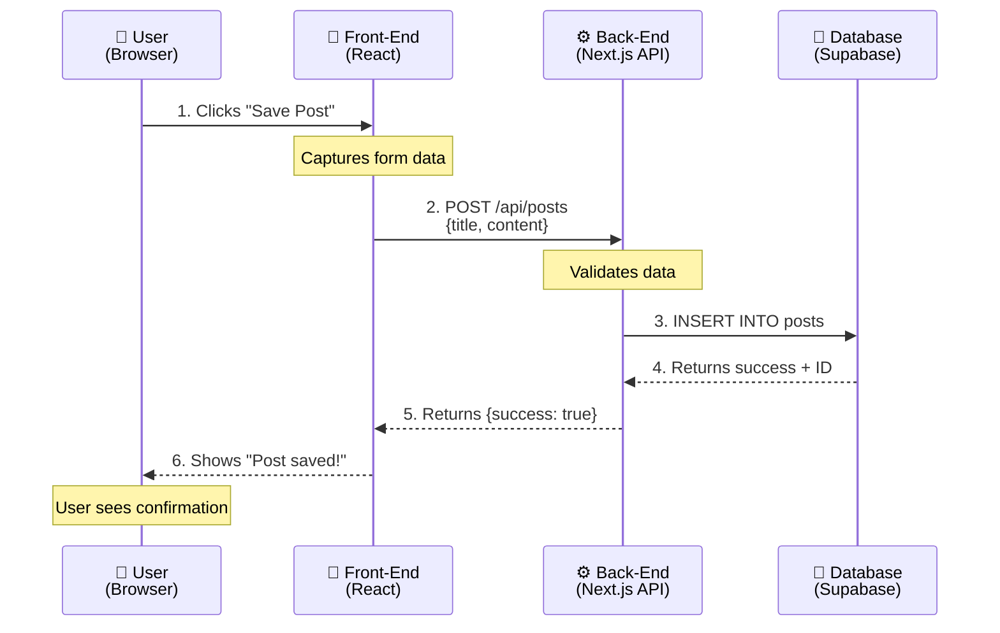

# Chapter 2: Understanding the Shape of Apps

> "You don't need to know how electricity works to use a light switch. You don't need to know how engines work to drive a car. And you don't need to know how code works to build an app."

## The Restaurant Analogy

Think of a web application like a restaurant. This analogy will help you understand the three main pieces of any app.

### The Dining Room (Front-End)

This is what customers see and interact with:
- The menu they read
- The tables they sit at
- The buttons they press to call the waiter
- The food they see presented on their plate

**In an app, this is:** The screens users see, the buttons they click, the forms they fill out, the images and text displayed.

**You describe it like:** "I want a login screen with email and password fields and a blue submit button."

### The Kitchen (Back-End)

This is where the actual work happens, hidden from customers:
- Chefs preparing the food
- Following recipes
- Managing inventory
- Coordinating timing

**In an app, this is:** The logic that processes requests, makes decisions, and handles the real work.

**You describe it like:** "When someone submits the login form, check if their password is correct and log them in."

### The Pantry (Database)

This is where ingredients and supplies are stored:
- Organized shelves
- Labels on everything
- Inventory tracking
- Relationships (tomatoes go with pasta, not desserts)

**In an app, this is:** Where all your data lives - user accounts, blog posts, uploaded files, everything that needs to be remembered.

**You describe it like:** "Store each user's email, password, and signup date. Remember which posts belong to which user."

**Visual: How Restaurant Maps to App**

```
┌─────────────────────────────────┬─────────────────────────────────┐
│         RESTAURANT              │           WEB APP               │
├─────────────────────────────────┼─────────────────────────────────┤
│                                 │                                 │
│  👥 DINING ROOM                 │  📱 FRONT-END                   │
│  • Menu boards                  │  • Login screens                │
│  • Tables & chairs              │  • Buttons & forms              │
│  • What customers see           │  • What users see               │
│           ↓                     │           ↓                     │
│     [WAITER carries order]  ────┼────→  [API sends request]       │
│           ↓                     │           ↓                     │
│  👨‍🍳 KITCHEN                     │  ⚙️  BACK-END                   │
│  • Chefs preparing food         │  • Processing logic             │
│  • Following recipes            │  • Making decisions             │
│  • Coordinating work            │  • Handling requests            │
│           ↓                     │           ↓                     │
│     [Chef gets ingredients] ────┼────→  [Back-end queries data]   │
│           ↓                     │           ↓                     │
│  🗄️  PANTRY                     │  💾 DATABASE                    │
│  • Organized shelves            │  • User accounts                │
│  • Labeled ingredients          │  • Stored posts                 │
│  • Inventory tracking           │  • Saved data                   │
│           ↓                     │           ↓                     │
│     [Waiter brings food]    ────┼────→  [API returns response]    │
│           ↓                     │           ↓                     │
│  ✅ Customer sees their meal    │  ✅ User sees their content     │
│                                 │                                 │
└─────────────────────────────────┴─────────────────────────────────┘
```

This is your foundational mental model. When you get confused later, come back to this: dining room = what users see, kitchen = where work happens, pantry = where data lives, waiters = how they communicate.

### The Waiters (APIs)

Waiters carry orders from dining room to kitchen and food from kitchen to dining room:
- Take customer orders
- Deliver to kitchen
- Bring back food
- Handle special requests

**In an app, this is:** The communication system between front-end and back-end.

**You describe it like:** "When someone clicks 'Save Post', send their text to the back-end to be stored in the database."


## Visual: Request Flow Diagram



💡 **This flow happens in milliseconds** - users just see instant feedback.

---
## What Happens When You Use an App

Let's walk through what happens when you post something on Instagram. You don't need to understand the technical details - just the flow:

**1. You type a caption and tap "Share"**
- The front-end (what you see) captures your text and photo

**2. Your phone sends it to Instagram's servers**
- Like a waiter carrying an order to the kitchen

**3. Instagram's back-end processes it**
- Checks you're logged in
- Resizes your photo
- Saves everything to their database
- Updates feeds for your followers

**4. You see "Post shared successfully"**
- The back-end sends confirmation back to your phone
- The front-end updates to show your new post

**The entire journey:** Front-end → Back-end → Database → Back-end → Front-end

**Visual: What Happens When You Post on Instagram**

```
┌──────────────────────────────────────────────────────────────────────┐
│              WHAT HAPPENS WHEN YOU POST ON INSTAGRAM                 │
└──────────────────────────────────────────────────────────────────────┘

 [1] YOUR PHONE               [2] SENT TO SERVER           [3] PROCESSING
 ┌────────────┐               ┌──────────────┐             ┌─────────────┐
 │            │               │              │             │             │
 │ 📱         │  ─────────►   │  ☁️ API      │  ────────►  │ ⚙️ Back-End │
 │            │               │              │             │             │
 │ You type:  │   [Request    │  Instagram   │  [Receives  │ Checks:     │
 │ "Caption"  │    travels    │  receives    │   your      │ • Are you   │
 │ Upload     │    across     │  your        │   data]     │   logged in?│
 │ photo      │    internet]  │  post]       │             │ • Valid     │
 │            │               │              │             │   photo?    │
 │ Tap SHARE  │               │              │             │ • Process   │
 │            │               │              │             │   image     │
 └────────────┘               └──────────────┘             └─────────────┘
                                                                   │
                                                                   ▼
 [5] YOU SEE RESULT           [4] SAVE TO DATABASE
 ┌────────────┐               ┌──────────────┐
 │            │               │              │
 │ ✅         │  ◄─────────   │  💾 Database │
 │            │               │              │
 │ "Post      │   [Success    │  Saves:      │
 │ shared     │    message    │  • Caption   │
 │ success!"  │    returns]   │  • Photo     │
 │            │               │  • Your ID   │
 │ See new    │               │  • Timestamp │
 │ post on    │               │              │
 │ profile    │               │  Updates:    │
 │            │               │  • Followers'│
 │            │               │    feeds     │
 └────────────┘               └──────────────┘

 ┌──────────────────────────────────────────────────────────────┐
 │ COMPLETE JOURNEY: Front-End → Back-End → Database →          │
 │                   Back-End → Front-End                       │
 └──────────────────────────────────────────────────────────────┘
```

Every app interaction follows this pattern. When you build your own features, you'll mentally trace this same journey.

You don't need to code this flow. You just need to describe: "Users should be able to type text, upload a photo, and share it. Then they should see their post appear in their profile."

## The Three Core Pieces (In Plain English)

### 1. Display Layer (What Users See)

**What it is:** Everything visible on screen
- Login forms
- Navigation menus
- Profile pages
- Settings screens
- Loading indicators

**What you control:** Layout, colors, text, buttons, images, animations

**How you describe it to AI:**
- "Create a card layout showing each product with image, title, and price"
- "Add a navigation bar at the top with Home, About, and Contact links"
- "Make the submit button green and center it below the form"

**What you ignore:**
- How browsers render HTML
- CSS specificity rules
- JavaScript DOM manipulation
- Component lifecycle methods

### 2. Logic Layer (What Happens)

**What it is:** The rules and processes
- "If password is wrong, show error"
- "When user clicks save, store to database"
- "Every night at midnight, send email reminders"
- "If user isn't logged in, redirect to login page"

**What you control:** The rules, conditions, and flows

**How you describe it to AI:**
- "Only logged-in users can create posts"
- "When someone signs up, send them a welcome email"
- "If they upload a file over 10MB, show an error"

**What you ignore:**
- Exact syntax of if-statements
- How functions are structured
- Memory management
- Error handling implementation

### 3. Storage Layer (What Gets Remembered)

**What it is:** The data that persists
- User accounts
- Blog posts
- Uploaded images
- Settings and preferences
- Order history

**What you control:** What data to save and how it connects

**How you describe it to AI:**
- "Save user email, name, and bio"
- "Each post has a title, body, and author"
- "Connect comments to the post they're commenting on"

**What you ignore:**
- SQL syntax
- Database indexing
- Query optimization
- Connection pooling

## How They Work Together: A Real Example

Let's trace what happens when you save a bookmark in our tutorial app (Chapter 4):

**User Action:** You paste a URL and click "Save Bookmark"

**Display Layer:**
1. Captures the URL you typed
2. Shows a loading spinner
3. Disables the save button (prevent double-clicks)

**Logic Layer:**
1. Receives the URL from display
2. Validates it's actually a URL
3. Checks you're logged in
4. Talks to storage layer: "Save this URL for this user"
5. Waits for confirmation
6. Sends success message back to display

**Storage Layer:**
1. Receives save request
2. Stores: URL, title, user_id, timestamp
3. Returns confirmation: "Saved successfully"

**Display Layer (again):**
1. Receives success confirmation
2. Hides loading spinner
3. Shows "Bookmark saved!" message
4. Adds bookmark to your list on screen

**You described this as:** "Users should be able to paste a URL and save it to their list. Show them a loading state while it saves, then add it to their bookmarks."

AI translated that into all the technical steps above.

## What You Can Safely Ignore

As a vibe coder, here's what you never need to understand:

### Computer Science Theory
- Big O notation
- Data structures and algorithms
- Binary trees and hash tables
- Complexity analysis

**Why:** AI knows all this. Your job is describing what you want, not how to optimize it.

### Programming Language Details
- Variable declaration syntax
- For-loop structure
- Class inheritance
- Type systems

**Why:** You're not writing the code. AI is. You describe in English, AI writes in JavaScript/Python/whatever.

### Infrastructure Details
- How servers handle requests
- Network protocols
- Load balancing
- Caching strategies

**Why:** Modern hosting platforms (Vercel, Railway) handle this automatically.

### Security Implementation
- How to hash passwords properly
- SQL injection prevention
- CSRF token generation
- XSS attack mitigation

**Why:** AI implements security best practices automatically. You just describe: "Users should have secure login."

## Mental Models That Actually Matter

These are the concepts worth understanding because they help you describe what you want:

### 1. Apps Are Conversations (Request/Response)

Every interaction is a back-and-forth:
- User: "Show me my profile"
- App: "Here's your profile data"
- User: "Update my bio to this new text"
- App: "Updated! Here's your new profile"

**Why this matters:** When describing features, think: "User asks for X, app responds with Y"

### 2. Data Has Shapes (Structure)

Data isn't just random text - it has structure:

**A user looks like:**
- Email (text)
- Name (text)
- Signup date (date)
- Profile picture (image)

**A blog post looks like:**
- Title (text)
- Body (long text)
- Author (connection to a user)
- Created date (date)

**Why this matters:** When describing what to store, think about the shape: "What pieces of information do I need for each [thing]?"

### 3. Everything Is Connected (Relationships)

Data connects to other data:
- Posts belong to users
- Comments belong to posts
- Likes connect users to posts
- Folders contain bookmarks

**Why this matters:** When describing features, think about ownership and connections: "Each post should know who wrote it. Each comment should know which post it's on."

**Visual: How Data Connects**

```
┌─────────────────────────────────────────────────────────────────────┐
│                    HOW DATA CONNECTS                                │
└─────────────────────────────────────────────────────────────────────┘

┌──────────────────────┐              ┌──────────────────────┐
│  👤 USER             │              │  📝 BLOG POST        │
├──────────────────────┤              ├──────────────────────┤
│ • Email (text)       │    wrote     │ • Title (text)       │
│ • Name (text)        │  ─────────►  │ • Body (long text)   │
│ • Signup date        │              │ • Created date       │
│ • Profile picture    │              │ • Published? (yes/no)│
│   (image)            │              │                      │
└──────────────────────┘              └──────────────────────┘
         │                                      │
         │ posted                               │ has
         ▼                                      ▼
┌──────────────────────┐              ┌──────────────────────┐
│  📷 PHOTO            │              │  💬 COMMENT          │
├──────────────────────┤              ├──────────────────────┤
│ • Image file         │              │ • Text               │
│ • Caption            │   attached   │ • Posted time        │
│ • Upload date        │  ◄──────to   │ • Author (→ User)    │
│ • Uploaded by        │              │ • On post (→ Post)   │
│   (→ User)           │              │                      │
└──────────────────────┘              └──────────────────────┘
         │                                      │
         │                                      │
         └──────────── both can have ───────────┘
                           │
                           ▼
                 ┌──────────────────────┐
                 │  ❤️  LIKE            │
                 ├──────────────────────┤
                 │ • Who liked (→ User) │
                 │ • What liked         │
                 │   (→ Post or Photo)  │
                 │ • When liked         │
                 └──────────────────────┘

┌─────────────────────────────────────────────────────────────────────┐
│ REAL EXAMPLE RELATIONSHIPS:                                         │
│                                                                     │
│ • Each POST belongs to ONE USER (the author)                       │
│ • Each USER can have MANY POSTS                                    │
│ • Each COMMENT belongs to ONE POST and ONE USER                    │
│ • Each LIKE connects ONE USER to ONE POST (or PHOTO)               │
└─────────────────────────────────────────────────────────────────────┘
```

Understanding these connections lets you describe features like "show me all the posts by this user" or "count how many comments this post has."

### 4. State Changes Over Time (Updates)

Things don't just exist - they change:
- User goes from "not logged in" to "logged in"
- Post goes from "draft" to "published"
- Order goes from "pending" to "paid" to "shipped"

**Why this matters:** When describing behavior, think about states and transitions: "When a user clicks publish, change the post from draft to published."

**Visual: How Things Change Over Time**

```
┌─────────────────────────────────────────────────────────────────────┐
│                    HOW THINGS CHANGE OVER TIME                      │
└─────────────────────────────────────────────────────────────────────┘

EXAMPLE 1: USER LOGIN STATUS
────────────────────────────────────────────────────────────────────────
  ┌──────────────┐    user enters     ┌──────────────┐
  │ NOT LOGGED   │    email/password  │   LOGGED     │
  │     IN       │ ─────────────────► │     IN       │
  │              │                    │              │
  └──────────────┘                    └──────────────┘
         ▲                                    │
         │                                    │
         │          user clicks logout        │
         └────────────────────────────────────┘
EXAMPLE 2: BLOG POST STATUS
────────────────────────────────────────────────────────────────────────
  ┌────────┐   author      ┌────────┐   author     ┌──────────┐
  │ DRAFT  │   saves       │ READY  │   clicks     │PUBLISHED │
  │        │ ────────────► │        │ ───────────► │          │
  └────────┘               └────────┘              └──────────┘
     ▲                        │                          │
     │     author edits       │                          │
     └────────────────────────┘                          │
     │                                                    │
     │          author unpublishes post                  │
     └───────────────────────────────────────────────────┘
EXAMPLE 3: ORDER LIFECYCLE
────────────────────────────────────────────────────────────────────────
  ┌─────────┐  customer   ┌─────────┐  payment  ┌─────────┐  item
  │ CART    │  clicks     │PENDING  │  goes     │  PAID   │  ships
  │         │  checkout   │ PAYMENT │  through  │         │  out
  └─────────┘ ──────────► └─────────┘ ────────► └─────────┘ ─────►
                                                       │
     ┌──────────────────────────────────────────────┐ │
     │                                                │ │
     ▼                                                ▼ ▼
  ┌─────────┐                                    ┌──────────┐
  │CANCELLED│                                    │ SHIPPED  │
  │         │                                    │          │
  └─────────┘                                    └──────────┘
                                                      │
                                                      ▼
                                                 ┌──────────┐
                                                 │DELIVERED │
                                                 │          │
                                                 └──────────┘

┌─────────────────────────────────────────────────────────────────────┐
│ KEY CONCEPT: Things move through states based on actions            │
│                                                                     │
│ When you describe features to AI, think:                           │
│ • What states exist? (draft, published, cancelled)                 │
│ • What triggers transitions? (click publish, enter password)       │
│ • Can you go backwards? (unpublish, logout)                        │
└─────────────────────────────────────────────────────────────────────┘
```

This teaches you to think about the lifecycle of things in your app, not just static snapshots.

## Practical Examples: How to Describe What You Want

### Bad: Too Vague
❌ "I need a user system"

### Good: Specific Shape
✅ "Users should be able to sign up with email and password, log in, and have a profile page showing their name and bio"

---

### Bad: Too Technical
❌ "Implement JWT-based authentication with bcrypt password hashing and refresh token rotation"

### Good: Describe the Outcome
✅ "Users should stay logged in even if they close the browser. Login should be secure."

---

### Bad: Implementation Details
❌ "Create a PostgreSQL table with foreign key constraints and a many-to-many junction table"

### Good: Describe the Relationship
✅ "Users can save multiple bookmarks. Each bookmark should remember who saved it and when."

---

### Bad: Mixing Concerns
❌ "Make the API endpoint return JSON with proper CORS headers and handle validation errors"

### Good: User-Focused
✅ "When someone submits an invalid email, show them a helpful error message"

**Visual: Good vs Bad Prompts**

```
┌─────────────────────────────────────────────────────────────────────┐
│              HOW TO DESCRIBE FEATURES TO AI                         │
│         (The difference between stuck and shipping)                 │
└─────────────────────────────────────────────────────────────────────┘

┌───────────────────────────────┬─────────────────────────────────────┐
│  ❌ DOESN'T WORK              │  ✅ WORKS WELL                      │
├───────────────────────────────┼─────────────────────────────────────┤
│                               │                                     │
│ "I need a user system"        │ "Users should sign up with email    │
│                               │  and password, log in, and have a   │
│ ⚠️  Problem: Too vague        │  profile page showing their name    │
│ AI doesn't know what you want │  and bio"                           │
│                               │                                     │
│                               │ ✓  Specific outcome described       │
│                               │ ✓  Clear features listed            │
├───────────────────────────────┼─────────────────────────────────────┤
│                               │                                     │
│ "Implement JWT-based auth     │ "Users should stay logged in even   │
│  with bcrypt and token        │  if they close the browser. Login   │
│  rotation"                    │  should be secure"                  │
│                               │                                     │
│ ⚠️  Problem: Too technical    │ ✓  Describes behavior, not code     │
│ You're telling AI HOW to code │ ✓  Lets AI choose best method      │
│                               │                                     │
├───────────────────────────────┼─────────────────────────────────────┤
│                               │                                     │
│ "Create a PostgreSQL table    │ "Users can save multiple bookmarks. │
│  with foreign keys and        │  Each bookmark should remember who  │
│  junction tables"             │  saved it and when"                 │
│                               │                                     │
│ ⚠️  Problem: Implementation   │ ✓  Describes relationships simply   │
│ AI knows database better      │ ✓  Focuses on what, not how         │
│                               │                                     │
├───────────────────────────────┼─────────────────────────────────────┤
│                               │                                     │
│ "Fix the API endpoint to      │ "When someone submits an invalid    │
│  handle validation errors"    │  email, show them a helpful error   │
│                               │ message"                            │
│                               │                                     │
│ ⚠️  Problem: Mixing concerns  │ ✓  User-focused outcome             │
│ Assumes technical knowledge   │ ✓  Clear cause and effect           │
│                               │                                     │
└───────────────────────────────┴─────────────────────────────────────┘

┌─────────────────────────────────────────────────────────────────────┐
│  THE PATTERN: Good Prompts Share These Traits                       │
│                                                                     │
│  ✓  Describe WHAT should happen, not HOW it should happen          │
│  ✓  Use plain English, not technical jargon                        │
│  ✓  Focus on user experience and outcomes                          │
│  ✓  Include specific details (file types, size limits, text shown) │
│  ✓  Think in terms of "when X happens, do Y"                       │
│                                                                     │
│  The question to ask yourself:                                     │
│  "If I was explaining this feature to a friend who isn't technical,│
│   could they understand what I want the app to do?"                │
│                                                                     │
│  If yes → good prompt. If no → too technical.                      │
└─────────────────────────────────────────────────────────────────────┘
```

This is the make-or-break skill for vibe coding. Clarity beats technical accuracy every time.

## The Flow of Building

Here's the process you'll follow in Chapter 4 and beyond:

**1. Describe the feature in plain English**
"I want users to be able to upload a profile picture"

**2. AI asks clarifying questions (or you anticipate them)**
"What file types? Size limit? What happens if they don't upload one?"

**3. You refine your description**
"Allow JPG and PNG up to 5MB. Show a default avatar if they haven't uploaded one."

**4. AI generates the code**
Creates front-end upload form, back-end file handling, storage configuration

**5. You test it**
Try uploading an image - does it work?

**6. You iterate if needed**
"The image is too big on the page, make it smaller"
"Add a crop feature before uploading"

**Notice:** You never wrote code. You described, tested, refined. That's vibe coding.

**Visual: The Vibe Coding Loop**

```
┌─────────────────────────────────────────────────────────────────────┐
│                    THE VIBE CODING LOOP                             │
│                   (This is your workflow)                           │
└─────────────────────────────────────────────────────────────────────┘

                    ┌──────────────────────┐
                    │   1. DESCRIBE        │
                    │   what you want      │
                    │                      │
                    │  "I want users to    │
                    │  upload a profile    │
                    │  picture"            │
                    └──────────┬───────────┘
                               │
                               ▼
    ┌──────────────────┐             ┌──────────────────┐
    │  6. ITERATE      │             │  2. CLARIFY      │
    │  if needed       │             │  details         │
    │                  │             │                  │
    │ "Make image      │             │ AI asks:         │
    │  smaller" or     │             │ • File types?    │
    │ "Add crop tool"  │             │ • Size limit?    │
    └────────┬─────────┘             └─────────┬────────┘
             │                                  │
             │                                  ▼
             │                       ┌──────────────────┐
             │                       │  3. REFINE       │
             │                       │  your vision     │
             │                       │                  │
             │                       │ "Allow JPG/PNG   │
             │                       │  up to 5MB"      │
             │                       └─────────┬────────┘
             │                                 │
             │                                 ▼
    ┌────────┴─────────┐             ┌──────────────────┐
    │  5. TEST         │             │  4. AI BUILDS    │
    │  does it work?   │             │  generates code  │
    │                  │             │                  │
    │ ✅ Works? Done!  │             │ • Upload form    │
    │ ❌ Issue? Back   │◄────────────│ • File handling  │
    │    to iterate    │             │ • Storage setup  │
    └──────────────────┘             └──────────────────┘
┌─────────────────────────────────────────────────────────────────────┐
│ KEY INSIGHT: You never leave this loop                             │
│                                                                     │
│ Building isn't linear—it's circular. You'll go through this loop   │
│ hundreds of times. Each time you:                                  │
│ • Describe more clearly                                            │
│ • Test more thoroughly                                             │
│ • Understand your product better                                   │
│                                                                     │
│ This is normal. This is how vibe coding works.                     │
└─────────────────────────────────────────────────────────────────────┘

┌─────────────────────────────────────────────────────────────────────┐
│ WHERE YOU SPEND YOUR TIME:                                         │
│                                                                     │
│ Describing/Clarifying: ████████░░ 40%                              │
│ Testing:               ██████░░░░ 30%                              │
│ Iterating/Refining:    █████░░░░░ 25%                              │
│ Waiting for AI:        █░░░░░░░░░  5%                              │
│                                                                     │
│ Notice: You spend almost NO time actually writing code.            │
└─────────────────────────────────────────────────────────────────────┘
```

When you hit frustration later ("why am I going back and forth so much?"), remember: this IS the process. You're doing it correctly.

## Common Misconceptions

### "I need to learn the basics first"
**Wrong.** The basics AI needs and the basics humans need are different. You need to understand shapes and flows. AI needs to understand syntax and implementation.

### "I should understand how it works under the hood"
**Wrong.** You should understand what it does, not how it does it. You know what a login does (verifies identity). You don't need to know how password hashing works.

### "Real developers would laugh at my code"
**Wrong.** AI writes better code than most developers. And besides - if it works and solves the problem, it's good enough.

### "I need to start with simple projects"
**Wrong.** Start with projects you care about. Motivation matters more than simplicity. AI handles complexity for you.

## What This Means for Building

When you get to Chapter 4 and start building, you'll be:

**Describing shapes:** "A bookmark has a URL, title, and save date"
**Describing flows:** "When user clicks save, store it and show success"
**Describing connections:** "Each bookmark belongs to the user who saved it"
**Describing states:** "Bookmarks can be public or private"

You'll **never** be:
- Writing `function handleSubmit() {`
- Debugging `Cannot read property of undefined`
- Worrying about `async/await` syntax
- Configuring webpack or babel

That's all AI's job.

Your job is being clear about what you want. And as a domain expert, you're already great at that - you know exactly what problem you're solving and how it should work.

Ready to choose your tools and stack? Let's make some decisions.

---

## Connect & Share

💌 **Newsletter**: [Build to Launch](https://buildtolaunch.substack.com) - Weekly AI building tips, templates, and real builder stories

✍️ **Medium**: [AI Builders](https://medium.com/ai-builders) - Read more articles and guides

💬 **Reddit**: [r/VibeCodingBuilders](https://www.reddit.com/r/VibeCodingBuilders/) - Join the community

🦋 **Bluesky**: [@jenny-ouyang](https://bsky.app/profile/jenny-ouyang.bsky.social) - Connect

💼 **LinkedIn**: [Jenny Ouyang](https://www.linkedin.com/in/jenny-ouyang/) - Connect